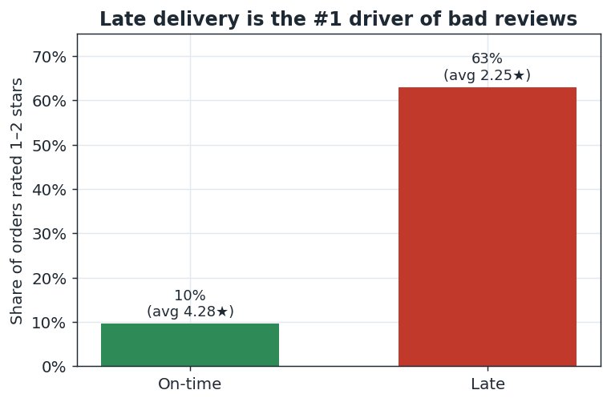
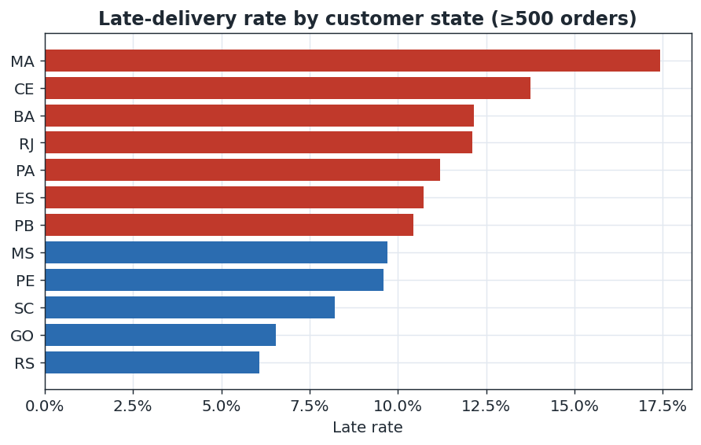
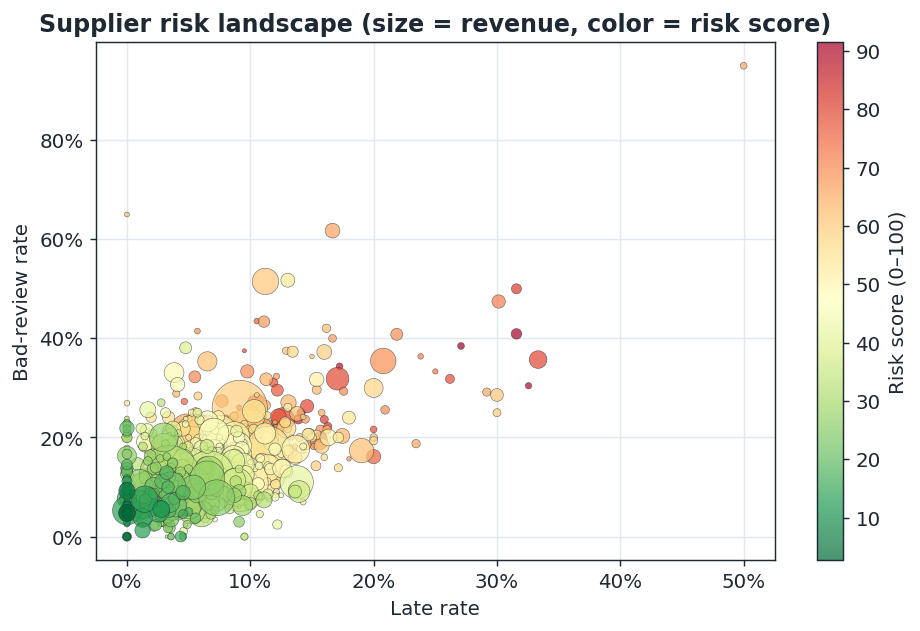
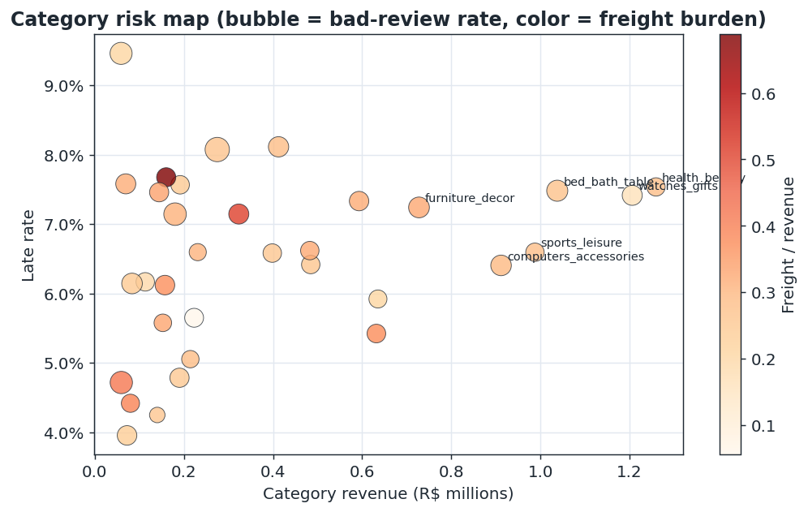
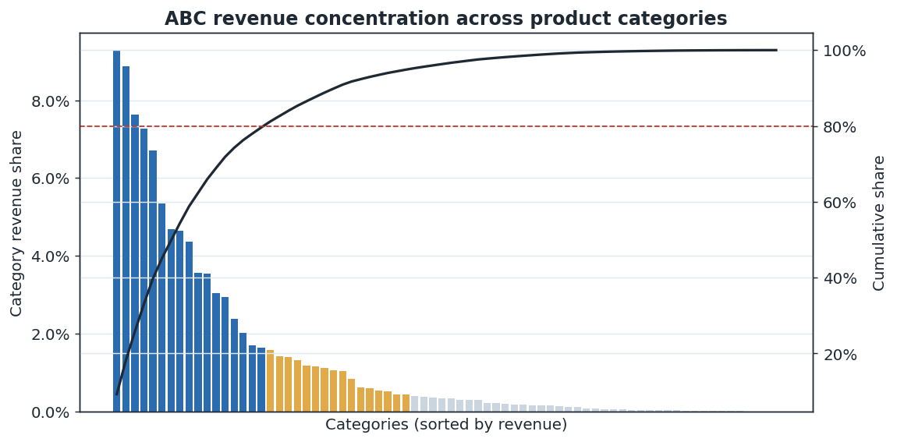

# Supply Chain Control Tower

**An operations-analytics product that tells a logistics team *where to intervene* — not just what happened.**
SQL star schema + tunable supplier risk score + a 5-page Looker Studio decision dashboard, built on **98,666 real marketplace orders**.

`SQL (DuckDB)` · `Python (pandas, matplotlib)` · `Looker Studio` · `dimensional modeling` · `KPI design`

> **Data:** [Olist Brazilian E-Commerce](https://www.kaggle.com/olistbr/brazilian-ecommerce) — real orders, Sept 2016–Oct 2018 (CC BY-NC-SA 4.0). **Not synthetic.** Where the source lacks a field (carrier mode, COGS, inventory), it is disclosed and omitted — never fabricated. See [field mapping](docs/data_dictionary.md#1-concept--real-signal-mapping-read-this-first).

---

## The one chart that frames the project


Overall on-time delivery is a healthy-looking **93.2%** — but late orders are **6.5× more likely to get a 1–2★ review** (62.9% vs 9.6%). The average hides the risk. This dashboard exists to find and prioritize that hidden risk.

## Problem
A marketplace ops team can see thousands of orders but can't see *where to act*. Delays, risky suppliers, margin-draining categories, and dissatisfied regions are buried in transactional tables. **Question:** given limited attention, which suppliers, regions, and products should an operations manager review *first*?

## Business questions answered
1. Where do fulfillment delays come from? *(region, time)*
2. Which suppliers create disproportionate operational risk?
3. Which products are revenue-rich but reliability- or margin-poor?
4. How concentrated is revenue, and where is it exposed to service failure?
5. What are the top interventions, in priority order?

## Key findings (all from real data)
| Finding | Evidence | So what |
|---|---|---|
| **Lateness drives dissatisfaction** | 62.9% bad-review rate on late orders vs 9.6% on-time; **R$986K** revenue exposed | Treat on-time delivery as a *revenue* KPI |
| **Risk is geographic** | Late rate **4.0% (PR) → 17.4% (MA)**; **RJ** = 2nd-biggest market at 12.1% late | Prioritize RJ + Northeast carrier SLAs |
| **Risk is concentrated in suppliers** | Worst quintile = 163 sellers, **R$2.7M** at 12.2% late / 23.8% bad-review | Run a supplier-improvement program, don't churn |
| **Revenue is concentrated** | 17 of 74 categories = **79.6%** of revenue; several at 28–37% freight burden | Focus margin work on A-class, heavy categories |

Full analysis → [`docs/executive_memo.md`](docs/executive_memo.md).

## Dashboard (Looker Studio)
Five decision-oriented pages, each answering one question: **Executive Overview · Fulfillment Performance · Supplier Scorecard · Product/SKU Risk · Executive Action View.**
Build spec & wireframe → [`dashboard/looker_studio_build_guide.md`](dashboard/looker_studio_build_guide.md). *(Live link + screenshots: see `dashboard/screenshots/`.)*

<table>
<tr>
<td></td>
<td></td>
</tr>
<tr>
<td></td>
<td></td>
</tr>
</table>

## The supplier risk score
A single tunable **0–100** ranking per supplier — the analytical centerpiece:
```
Risk = 100 × ( 0.30·late_rate + 0.20·cancel_rate + 0.20·bad_review_rate
             + 0.15·freight_burden + 0.15·demand_volatility )   # each percentile-ranked
```
Explainable, outlier-robust (percentile-ranked components), and tunable in one `SELECT`. It's a **prioritization tool, not a verdict**. Full rationale → [`docs/kpi_dictionary.md`](docs/kpi_dictionary.md#supplier-risk-score-the-centerpiece).

## Data model
A star schema (`fact_orders`, `fact_order_items` + 4 dimensions) → 5 analysis marts. Diagram → [`assets/schema_diagram.md`](assets/schema_diagram.md).

```
raw Olist CSVs ─▶ 01_schema.sql ─▶ 02_cleaning.sql ─▶ 03_kpi_views.sql ─▶ marts ─▶ Looker Studio
                 (staging+dims)    (fact tables)      (KPIs + risk score)  (CSV)
```

## Reproduce
```bash
python -m venv .venv && source .venv/bin/activate
pip install -r requirements.txt
python src/download_data.py     # fetch raw Olist CSVs (62 MB) into data/raw/
python src/run_pipeline.py      # run SQL star schema + marts -> data/processed/*.csv
python src/make_figures.py      # regenerate the figures in this README
```
SQL is plain DuckDB and also runs standalone: `duckdb < sql/01_schema.sql` (from repo root). EDA walkthrough → [`notebooks/01_eda.ipynb`](notebooks/01_eda.ipynb).

## Repo structure
```
sql/        01_schema · 02_cleaning · 03_kpi_views        (DuckDB star schema + KPIs)
src/        download_data · run_pipeline · make_figures   (reproducible pipeline)
data/       raw (gitignored) · processed/mart_*.csv       (Looker data sources)
dashboard/  looker_studio_build_guide.md · screenshots/
docs/       data_dictionary · kpi_dictionary · executive_memo · case_study
assets/     schema_diagram.md · figures/
notebooks/  01_eda.ipynb
```

## Limitations (read before reusing conclusions)
- **Associations, not causation.** Late↔bad-review is correlational; quantifying the causal retention effect needs an experiment.
- **No COGS** in the source → "margin pressure" uses **freight-to-revenue**, a proxy, not true gross margin.
- **Returns/defects proxied** by cancellations and 1–2★ reviews; no returns or defect tables exist.
- **No carrier mode, warehouse, or inventory** in Olist → shipping-mode and stockout analyses are omitted, not invented; product risk uses ABC-by-revenue instead.
- **One marketplace, 2016–2018, Brazil.** Re-validate before acting on current operations.

## What I'd do next
Geospatial transit modeling (state-level lead-time prediction) · a causal/quasi-experimental estimate of the late→churn effect · scheduled refresh into BigQuery so Looker reads live data · a per-supplier alerting threshold on the risk score.

---
*Part of a 3-project portfolio: this (operational analytics) · [Healthcare Risk + Fairness Modeling](https://github.com/ChinmayA301/Risk-Prediction-with-Fairness-Geography) · [Tabular ML Benchmark](https://github.com/ChinmayA301/Tabular-ML-Benchmark-Human-Feature-Engineering-vs-AutoML-Agentic-Baselines).*
