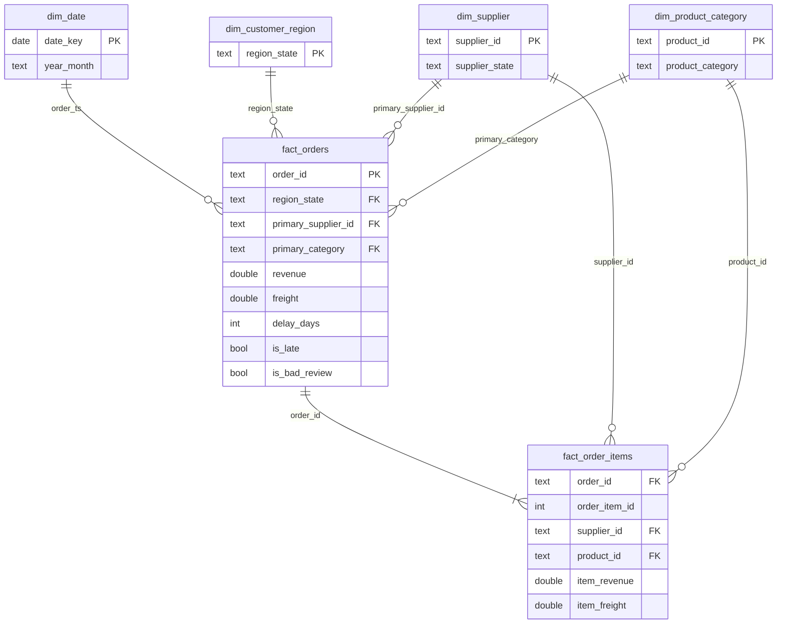

# Star Schema

`fact_orders` is the order-grain fact (one row per order, denormalized for BI).
`fact_order_items` is the line-grain fact used to attribute revenue and risk to
individual suppliers. The five marts are aggregations over these two tables.
